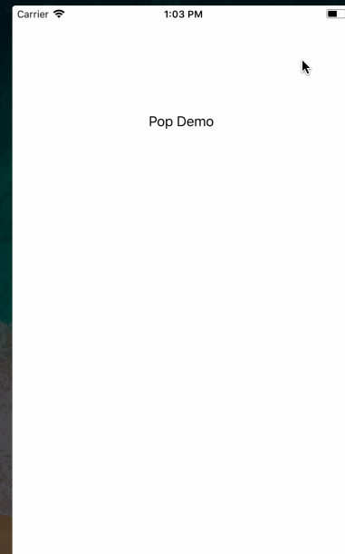

# PopOverlay

## App 内弹窗管理器 

提供功能:
1. 面向协议，为view，vc 等，提供弹窗能力。
2. 在app生命周期内，任何位置，快速任意添加一个弹窗。

常见场景：
1. App内的很多view 或者 vc 已经开发OK。 需要更改弹出样式为 pop
2. App启动登陆时，很多通知弹窗。

## 讨论
1. 其他实现方式：
1.1.1.  代码硬编：在每个业务view消失的时刻，弹出下一个业务view；
1.1.2.  事件通知：在每个业务view消失的时刻，发通知，触发下一个view
1.1.3.  类事件通知：数组存储所有业务view。一个个消失回调遍历触发
2.  本框架在1.1.3基础上，进一步将请求+回调处理，抽象为对象。在需要时触发，实例化业务view显示